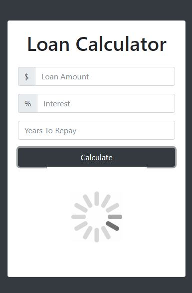
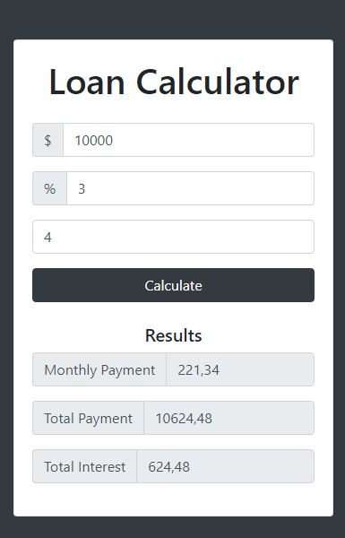
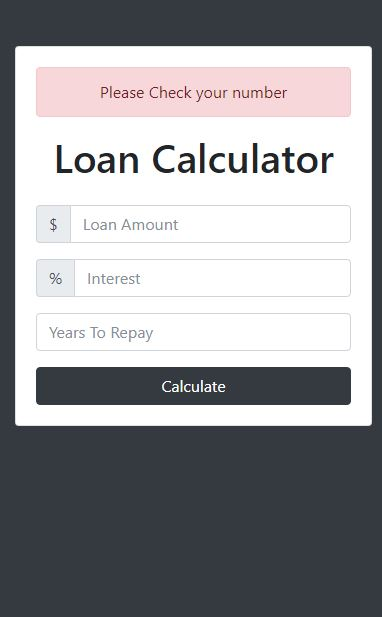

# Pure JavaScript

## Welcome! 👋

### The challenge

- Build out the project using VanillaJS .

### Screenshot

### Screenshot

### Screenshot

### Links

- Live Site URL: [github-pages](https://rottini.github.io/loan-calculator/)

## Author

- Website - [Rafael](https://github.com/rottini)
[project](https://github.com/rottini/loan-calculator)